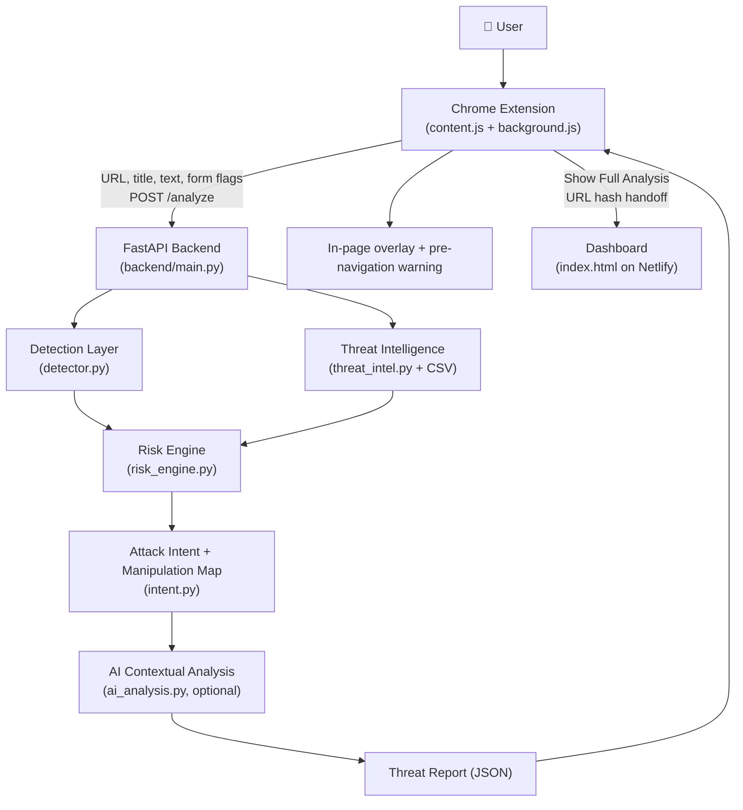
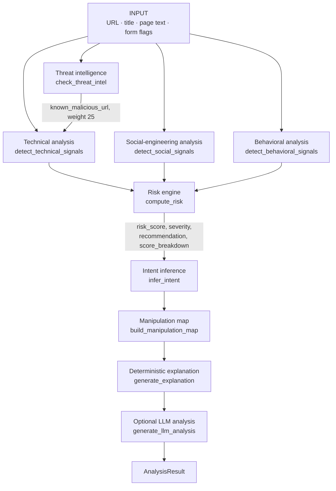
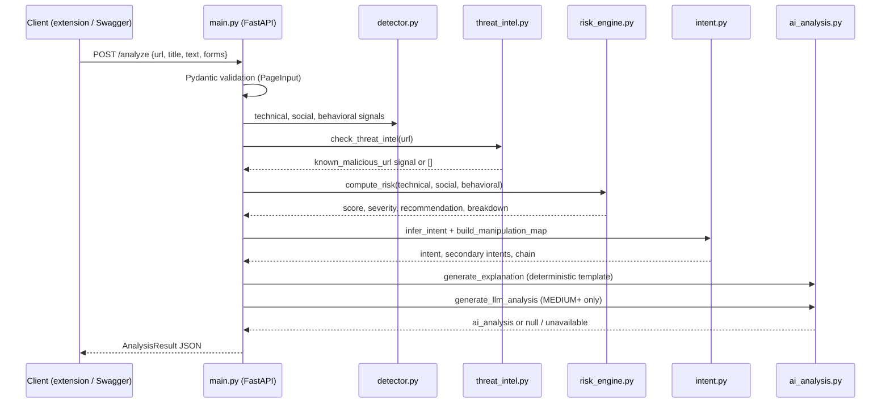
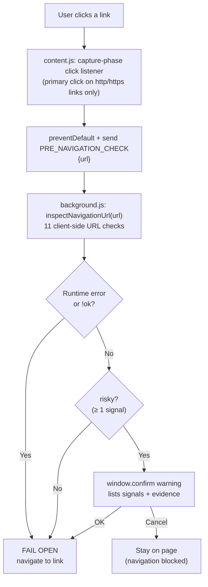
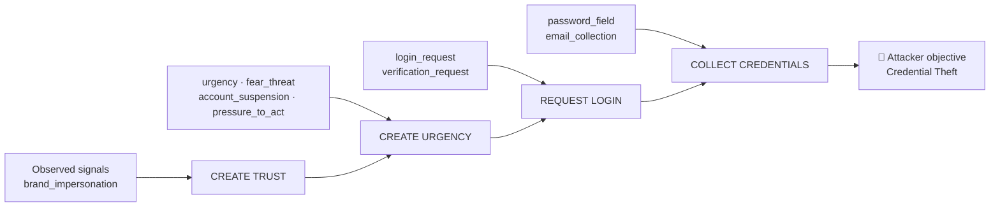

<div align="center">

# 🛡️ DarkShield

## Don't Just Detect the Threat. Understand the Manipulation.

**An explainable cybersecurity system that detects phishing, scams and social-engineering attacks by correlating technical, social-engineering and behavioral evidence, then explains how the attacker is manipulating the user.**

Team **AcaiHack** · **Async'26** · Track: **Spam & Social Engineering Detection**

[Live Dashboard](https://cheerful-cannoli-d30797.netlify.app/) · [Backend API](https://darkshield-final.onrender.com/) · [Swagger / OpenAPI](https://darkshield-final.onrender.com/docs) · [Demo Video](#-demo)
[Open=router API key](<API_KEY>)

</div>

---

## Why DarkShield

A scammer does not need to compromise a computer. They manipulate a person's decisions with **urgency, fear, scarcity, impersonation, fake social proof, payment pressure and credential requests**.

Most security tools tell a user *that* something is suspicious. DarkShield tries to explain:

| Question | DarkShield's answer comes from |
|---|---|
| **What makes this suspicious?** | Weighted technical, social and behavioral signals, each with its evidence |
| **How is the attacker manipulating me?** | A manipulation map (attack chain) built from the observed signals |
| **What does the attacker want?** | Rule-based attack-intent inference (primary and secondary intents) |
| **Why should I trust this result?** | A deterministic, auditable risk engine. The score is not produced by an LLM |
| **What should I do?** | Severity-based recommendation and a plain-language explanation |

> **Design principle:** detection and scoring are deterministic and rule-based. AI is an optional, read-only *explanation* layer on top. It never changes the score, severity or intent.

---

## Table of Contents

1. [Key Features](#-key-features)
2. [Research Gap](#-research-gap)
3. [Architecture](#-architecture)
4. [Detection & Analysis Engine](#-detection--analysis-engine)
5. [Browser Extension](#-browser-extension)
6. [Backend API](#-backend-api)
7. [Dashboard](#-dashboard)
8. [Tech Stack](#-tech-stack)
9. [Project Structure](#-project-structure)
10. [Installation & Running](#-installation--running)
11. [Environment Variables](#-environment-variables)
12. [Testing & Validation](#-testing--validation)
13. [Deployment](#-deployment)
14. [Security & Privacy](#-security--privacy)
15. [Limitations & Known Issues](#-limitations--known-issues)
16. [Future Work](#-future-work)
17. [Demo](#-demo)

---

## ✨ Key Features

Every feature below is implemented in this repository.

| Area | What is implemented |
|---|---|
| **Technical URL analysis** | 13 backend technical signals: IP host, `@` in URL, brand-in-unrelated-domain, suspicious TLD, hyphenated domain, deep subdomains, phishing keywords in host, punycode, redirect parameter, long URL, insecure HTTP collecting data, malformed URL, known malicious URL (`backend/detector.py`, `backend/threat_intel.py`) |
| **Social-engineering detection** | 9 language-pattern rules over page title and text: urgency, pressure to act, scarcity, limited time, fear/threat, account suspension, verification demand, social proof, popularity claims |
| **Behavioral analysis** | 8 behavioral signals derived from form structure and page text: password, email, login, account-verification, sensitive-data (OTP/PIN/ID) requests, payment, card number, CVV |
| **Threat intelligence** | Exact-match lookup against a local 10,000-row URL dataset, with no network call during analysis |
| **Explainable risk scoring** | Per-category weighted points, category caps, a multi-category combination bonus, severity bands and a `score_breakdown` in every response |
| **Attack intent** | Primary and secondary intent inferred by rules (`Credential Theft`, `Financial Information Theft`, `Social Engineering`, `Suspicious Activity`) |
| **Manipulation map** | Ordered attack-chain stages, each marked `observed` or not, with the signal IDs that evidence it |
| **AI contextual explanation** | Optional OpenRouter LLM layer for MEDIUM+ results. Its output is schema-constrained and validated against detected evidence, and the API works identically without it |
| **Pre-navigation protection** | Chrome extension intercepts link clicks, inspects the destination URL and shows a warning before the user navigates |
| **Dashboard reporting** | Web dashboard with a risk gauge, signal grids, manipulation map, history and a full-report view that can open an analysis handed over from the extension |
| **API / Swagger** | FastAPI service with typed request/response models and auto-generated OpenAPI docs |

---

## 🔭 Research Gap

Conventional detection often concentrates on **artifacts**: URLs, domains, reputation lists and known-bad indicators. Those signals are valuable, but social-engineering attacks also exploit **human decision-making** through urgency, fear, scarcity, impersonation, fake authority, fake social proof, payment pressure and credential requests.

The gap DarkShield explores is the step from

> *"Is this artifact suspicious?"*

to

> *"How is the attacker manipulating the user, what are they trying to achieve, and how can the evidence be explained?"*

DarkShield does not claim to be the first system to combine these ideas. It is a research prototype that correlates technical, social and behavioral evidence and translates it into risk, intent, manipulation steps and an explanation.

| Practical gap | DarkShield's approach (as implemented) |
|---|---|
| Technical-only detection | Technical **+** social **+** behavioral evidence, scored per category |
| Binary "safe / unsafe" warning | 0–100 risk score, severity, per-signal evidence and a `score_breakdown` |
| Unknown attacker objective | Rule-based **attack-intent** inference with secondary intents |
| Hidden manipulation strategy | **Manipulation map** showing which attack-chain stages were observed |
| Threat-intel lists miss new pages | Local threat-intel match *complements* language and behavior detection, so unlisted pages can still be flagged |
| Late intervention (after the page loads) | Pre-navigation URL check on link clicks before the browser navigates |
| Opaque AI decisions | Deterministic detection and scoring; the LLM only explains and cannot alter results |

---

## 🏗️ Architecture

### High-level architecture



### Detection pipeline



### Backend / API flow



### Pre-navigation protection



### Attack / manipulation chain



*The chain above is the real output for the `test_3b` phishing example (see [Manipulation Map](#8-manipulation-map--attack-chain)). It is an example, not a guaranteed output for every page.*

---

## 🔬 Detection & Analysis Engine

The engine lives in `backend/` and is invoked by `run_analysis()` in `backend/main.py`. All detection logic is rule-based. **No trained ML model is used for detection or scoring.**

### 1. Input / Evidence Extraction

**What enters the backend** (`PageInput` in `backend/main.py`):

| Field | Type / limit | Origin |
|---|---|---|
| `url` | string, 1–2048 chars | `window.location.href` |
| `title` | string, ≤ 300 chars | `document.title` |
| `text` | string, ≤ 20,000 chars | `document.body.innerText`, sliced to 20,000 chars by the extension |
| `forms` | list of ≤ 20 `FormInfo` | Derived from DOM forms by `collectPageData()` in `content.js` |

`FormInfo` carries `type`, plus booleans `password`, `email`, `payment`, `card`, `cvv`. The extension sets them by inspecting each form's `<input>`/`<textarea>`/`<select>` elements (input `type`, `name`, `placeholder`, `autocomplete`) and assigns a form `type` of `login`, `payment`, `form` or `unknown`. Only these flags are sent. Field *values* are never read or sent.

Dashboard "Quick Analysis" and the DNS-log importer take a different input path. See [Dashboard](#-dashboard).

Each detector returns **signals** in a common shape:

```json
{ "id": "urgency", "label": "artificial urgency", "description": "...", "weight": 10, "evidence": ["within 24 hours"] }
```

`detector.py` only *extracts evidence*. It does no scoring. `risk_engine.py` decides how weights combine.

### 2. Technical Signal Detection

Implemented in `detect_technical_signals()` (`backend/detector.py`). Host splitting uses a small second-level-label list (`co`, `com`, `org`, `net`, `gov`, `edu`, `ac`) rather than a full public-suffix list.

| Signal `id` | Weight | Detection logic | Security relevance |
|---|---:|---|---|
| `ip_address_host` | 20 | Host is a raw IP address that is **not** private or loopback | Legitimate public services rarely use bare IPs. Private/loopback IPs are deliberately ignored to avoid router/localhost false positives |
| `at_symbol_in_url` | 20 | `@` present in the URL's netloc | `http://paypal.com@evil.top/` really goes to `evil.top` |
| `brand_impersonation` | 15 | A known brand (list of 16, e.g. `paypal`, `google`, `hdfc`, `flipkart`) appears as a host token but the registered domain label is **not** that brand | Catches `paypal.com.evil.top` / `paypal-help.com` without flagging genuine brand domains |
| `phishy_keywords` | 10 | ≥ 2 distinct words from a phishing vocabulary (`login`, `verify`, `secure`, `account`, `update`, `wallet`, `billing`, …) in the hostname | Stacked trust words such as `secure-account-verify` |
| `suspicious_redirect` | 10 | A query parameter in a redirect-name set (`redirect`, `next`, `url`, `continue`, …) holds an `http(s)://` or `//` URL pointing to a different host | Open-redirect style hand-off to another site |
| `suspicious_tld` | 8 | TLD in a set of 18 abuse-heavy TLDs (`xyz`, `top`, `tk`, `zip`, …) | Weak on its own. Many legitimate sites use them |
| `hyphenated_domain` | 8 | Registered domain label contains ≥ 2 hyphens | Common lookalike-domain pattern |
| `deep_subdomains` | 8 | ≥ 3 subdomain labels | Buries the real registered domain |
| `punycode_domain` | 6 | Any host label starts with `xn--` | Possible lookalike characters (legitimate IDNs exist) |
| `insecure_http` | 6 | Scheme is `http` **and** any form asks for a password, payment, card or CVV | Plain HTTP only matters when sensitive data is collected |
| `long_url` | 4 | URL length ≥ 150 characters | Can obscure the real destination |
| `unparseable_url` | 5 | URL cannot be parsed into a valid host | Malformed input |
| `known_malicious_url` | 25 | Exact match in the local threat-intel dataset (see §5) | Known-bad indicator |

All are **URL-level** except `insecure_http` (URL + form-level) and `known_malicious_url` (threat-intelligence based).

### 3. Social-Engineering Detection

Implemented in `detect_social_signals()` via `_SOCIAL_RULES`. The title and page text are joined, apostrophes unified, whitespace collapsed and lowercased, then run through compiled regexes.

Design properties (from the source comments and code):

* **One signal per rule.** Repeating a phrase 50 times cannot inflate the score.
* **Up to 3 distinct matched snippets** (≤ 80 chars each) are kept as evidence.
* **Bounded regexes** (no nested quantifiers) so hostile page text cannot trigger slow matching. Page content is treated as untrusted input.

| Signal `id` | Weight | Manipulation tactic | Example patterns (abridged) |
|---|---:|---|---|
| `account_suspension` | 12 | Loss threat | "account … suspended/locked/blocked", "to avoid suspension" |
| `verification_request` | 12 | Pretext / false authority | "verify your account", "confirm your identity", "update your payment details" |
| `urgency` | 10 | Time pressure | "urgent", "immediately", "final notice", "within 24 hours" |
| `pressure_to_act` | 10 | Forced immediate action | "act now", "click here now", "don't wait" |
| `fear_threat` | 10 | Fear | "security alert", "unauthorized access", "account has been compromised", "legal action" |
| `scarcity` | 8 | Artificial scarcity | "only 3 left", "while supplies last", "selling fast" |
| `limited_time` | 8 | Artificial deadline | "limited time", "flash sale", "offer expires", "countdown" |
| `social_proof` | 6 | Fake social proof | "1,200 people are viewing", "join 5,000 customers" |
| `fake_popularity` | 5 | Trust claims | "trusted by millions", "#1 rated", "100% guaranteed" |

**Why this matters:** these phrases are the *levers* of manipulation. Urgency and fear suppress careful verification, scarcity and social proof push impulsive purchases, and "verify your account" is the standard pretext for credential harvesting. Each language signal is weak alone (many legitimate pages use sales language), so the engine relies on *combinations* (see §6).

### 4. Behavioral Detection

Implemented in `detect_behavioral_signals()`. Behavioral signals describe **what the page asks the user to do or hand over**, using the form flags from the extension plus a few text patterns.

| Signal `id` | Weight | Trigger |
|---|---:|---|
| `password_field` | 15 | Any form has a password field |
| `payment_collection` | 15 | Any form flagged `payment` |
| `cvv_collection` | 15 | `cvv` form flag **or** text matches `cvv`, `cvc`, `security code` |
| `card_number` | 12 | `card` form flag **or** text matches `card number`, `expiry/expiration date` |
| `sensitive_action` | 12 | A verb ("enter", "provide", "share", "submit", "reply with", …) followed within 40 characters by OTP, UPI/ATM PIN, Aadhaar, SSN, seed/recovery phrase or private key |
| `account_verification` | 8 | Form `type` is a verification type (`verification`, `verify`, …) |
| `email_collection` | 5 | Any form has an email field |
| `login_request` | 5 | Login-type form, **or** password field + "sign in / log in" text |

**Relationship to intent:** behavioral signals are the strongest evidence of the attacker's *objective*. Credential-type signals point to credential theft, and payment-type signals point to financial theft (see §7). A login form alone is common on legitimate sites, which is why behavioral points are capped below the MEDIUM threshold.

### 5. Threat Intelligence

Implemented in `backend/threat_intel.py`; data in `backend/data/malicious_urls.csv`.

| Aspect | Implementation |
|---|---|
| **Dataset** | Local CSV with header `url,label,source`. **10,000 rows: 5,000 `benign` and 5,000 `malicious`.** The `source` column value is `dataset` for all rows |
| **Loading** | Read once with `csv.DictReader` and cached in memory (`_FEED_CACHE`). Missing file → empty feed |
| **Normalization** | `_normalise_url()`: trim, prepend `http://` if no scheme, lowercase scheme and host, strip trailing dot, default path `/`, keep query. Result: `scheme://host/path[?query]` (fragment dropped) |
| **Matching** | **Exact match** on the normalized string. No fuzzy, prefix or domain-level matching. Because the scheme is part of the key, `http://` and `https://` forms of the same URL are different entries |
| **Labels** | Only `label == "malicious"` (case-insensitive) produces a signal. `benign` rows and unknown URLs produce **nothing**. Unknown ≠ safe |
| **Output** | One signal: `known_malicious_url`, weight **25**, evidence = normalized URL (+ `source: …` if present) |
| **Entry into scoring** | `main.py` appends it to the **technical** signal list, so it is subject to the technical category cap (40) |
| **Network** | None during `/analyze` |

Threat intelligence **complements** behavioral and social detection and does not replace it. A URL that is not in the dataset can still score HIGH or CRITICAL from its language and form behavior.

> The dataset is a static local file. This repository does **not** implement a continuously updating or commercial threat feed.

### 6. Risk Engine

Implemented in `backend/risk_engine.py`. The docstring states it plainly: **"explainable heuristic scoring. This is NOT a trained ML model."**

**Constants (verbatim from the source):**

| Constant | Value |
|---|---|
| `CATEGORY_CAPS` | `technical: 40`, `social: 40`, `behavioral: 30` |
| `MIN_MEANINGFUL_POINTS` | `8` |
| `COMBINATION_BONUS` | `{2: 10, 3: 25}` |
| `SEVERITY_BANDS` | `≥ 80 → CRITICAL`, `≥ 60 → HIGH`, `≥ 35 → MEDIUM`, `≥ 0 → LOW` |

**Algorithm (mirrors the real code):**

```text
function compute_risk(technical, social, behavioral):
    # 1–3. sum signal weights per category, apply category cap
    technical_pts  = min(sum(s.weight for s in technical),  40)
    social_pts     = min(sum(s.weight for s in social),     40)
    behavioral_pts = min(sum(s.weight for s in behavioral), 30)

    # 4. count categories that are "meaningfully present"
    categories_present = count(pts >= 8 for pts in [technical_pts, social_pts, behavioral_pts])

    # 5. combination bonus (1 or 0 categories → 0)
    bonus = {2: 10, 3: 25}.get(categories_present, 0)

    # 6. aggregate and clamp to 0–100
    score = max(0, min(100, technical_pts + social_pts + behavioral_pts + bonus))

    # 7. severity from thresholds, checked highest → lowest
    severity = CRITICAL if score >= 80 else HIGH if score >= 60 else MEDIUM if score >= 35 else LOW

    return {
        risk_score: score,
        severity: severity,
        recommendation: RECOMMENDATIONS[severity],
        score_breakdown: { technical, social, behavioral,
                           combination_bonus: bonus, categories_present }
    }
```

**Why caps and a combination bonus?** (stated in the source) A suspicious domain, a pushy sales page or a normal login form are each common on legitimate sites, so no single category may reach HIGH. Real phishing *combines* deception + pressure + a data request, so meaningful evidence in several categories raises the risk.

Consequences that follow directly from the constants:

* Technical alone: max 40 → at most **MEDIUM**. Social alone: max 40 → at most **MEDIUM**.
* Behavioral alone: max 30 → always **LOW** (a normal login or checkout page stays LOW).
* The theoretical sum before clamping is up to 135 (40 + 40 + 30 + 25); the final score is clamped to 100.

**Recommendations by severity (verbatim):**

| Severity | Recommendation |
|---|---|
| LOW | No major indicators detected. |
| MEDIUM | Review the detected signals before continuing. |
| HIGH | Proceed with extreme caution and verify the website. |
| CRITICAL | Do not enter credentials or payment information. |

> **Risk Score is an assessment of observed threat signals, not a probability of fraud.**

### 7. Attack Intent

Implemented in `infer_intent()` (`backend/intent.py`).

1. If `risk_score < 35` (below MEDIUM) → `attack_intent = "None Detected"`, `secondary_intents = []`. Signals are still returned as evidence.
2. Otherwise sum **behavioral** weights separately:
   * **credential evidence:** `password_field`, `email_collection`, `login_request`, `account_verification`, `sensitive_action`
   * **financial evidence:** `payment_collection`, `card_number`, `cvv_collection`
3. **Primary intent rules:**

| Condition | Primary intent | Secondary |
|---|---|---|
| Both credential and financial evidence | The **larger** weight wins (**ties go to Financial**) | The losing theft intent is kept as secondary |
| Only financial evidence | `Financial Information Theft` | – |
| Only credential evidence | `Credential Theft` | – |
| Neither, and social weight ≥ 20 **or** ≥ 2 social signals | `Social Engineering` | – |
| Otherwise | `Suspicious Activity` | – |

4. **Additional secondary intents** (uncapped weight sums):
   * `Technical Deception`: technical total ≥ 15
   * `Psychological Manipulation`: social total ≥ 15 and primary ≠ `Social Engineering`
   * `Sensitive Action Requested`: any behavioral signal present

This avoids labeling "everything with a login form" as credential theft. The intent is only assigned once the risk score reaches MEDIUM.

### 8. Manipulation Map / Attack Chain

Implemented in `build_manipulation_map()`. Each intent has an ordered chain of stages, and each stage lists the signal IDs that would evidence it:

| Intent | Stages (in order) |
|---|---|
| **Credential Theft** | `CREATE TRUST` → `CREATE URGENCY` → `REQUEST LOGIN` → `COLLECT CREDENTIALS` |
| **Financial Information Theft** | `BUILD TRUST` → `CREATE URGENCY` → `CREATE SCARCITY` → `PUSH TRANSACTION` → `COLLECT PAYMENT DATA` |
| **Social Engineering** (also used for `Suspicious Activity`) | `GAIN ATTENTION` → `CREATE EMOTIONAL PRESSURE` → `PUSH USER ACTION` |

For each stage the output is `{ "stage", "observed": bool, "evidence": [signal ids] }`. `observed` is true if any of the stage's signal IDs were actually detected, so the map shows **which parts of the attack chain the evidence supports**. For `None Detected`, the map is empty.

**Observed signal → tactic → user action → attacker objective**, using the real output for the `test_3b` input:

```text
Input: http://accounts-google-verify.top/login   title: "Sign in - Google"
       text: "Security alert: unusual sign-in detected. Verify your account within 24 hours
              or your account will be suspended. Act now!"      form: login (password + email)

brand_impersonation ───────────────► CREATE TRUST          (observed)
account_suspension, fear_threat,
pressure_to_act, urgency ──────────► CREATE URGENCY        (observed)
login_request, verification_request ► REQUEST LOGIN        (observed)
email_collection, password_field ──► COLLECT CREDENTIALS   (observed)
                                      └─► Attacker objective: Credential Theft
```

*Verified by running the repository's `detector`, `risk_engine` and `intent` modules on that input: score **100**, severity **CRITICAL**, intent **Credential Theft**, secondary intents `Technical Deception`, `Psychological Manipulation`, `Sensitive Action Requested`. Raw category points were technical 47 → capped 40, social 54 → capped 40, behavioral 25, combination bonus 25 (130 → clamped to 100).*

### 9. AI Contextual Analysis

Implemented in `backend/ai_analysis.py`.

```text
DETERMINISTIC DETECTION  →  RULE-BASED RISK SCORE  →  INTENT / MANIPULATION MAP  →  AI CONTEXTUAL EXPLANATION
      (detector.py)              (risk_engine.py)             (intent.py)                (ai_analysis.py, optional)
```

**The AI does not detect threats and does not score them.** The source states the LLM layer *"only INTERPRETS those results … It never changes a score, a severity or an intent, and the API works identically without it."*

There are two distinct explanation outputs:

| Output | Field | Behavior |
|---|---|---|
| **Deterministic explanation** | `explanation` | A template built from detected signals and intent. Always present, needs no API key or network. (A pluggable provider hook `register_provider` / `DARKSHIELD_AI_PROVIDER` exists, but no provider is registered by default.) |
| **LLM contextual analysis** | `ai_analysis` | Optional OpenRouter call that returns `tactics`, an `attack_chain` and a short `explanation` |

**When the LLM is invoked:**

| Condition | Result in `ai_analysis` |
|---|---|
| Severity is `LOW` | `null` (the LLM is never called) |
| Severity MEDIUM/HIGH/CRITICAL, no `OPENROUTER_API_KEY` **or** `DARKSHIELD_LLM=off` | `{"available": false, "message": "AI analysis unavailable. Showing rule-based analysis.", ...}` |
| Severity MEDIUM+ and enabled, call succeeds and validates | `{"available": true, "tactics": [...], "attack_chain": [...], "explanation": "..."}` |
| Provider error, HTTP error, timeout, empty or invalid output | Same `available: false` fallback. The API never fails because of the LLM |

**Request details:**

* Endpoint: OpenRouter chat completions (`OPENROUTER_API_URL`, default `https://openrouter.ai/api/v1/chat/completions`). Single blocking request, **no retries**, `temperature` 0.1.
* Model: `LLM_MODEL`, default `openrouter/free` (the source recommends pinning a structured-output-capable model, e.g. `openai/gpt-4o-mini`, for consistency).
* `LLM_TIMEOUT` default 30 s. `LLM_MAX_TOKENS` default 1500 (reasoning tokens share this budget).
* **Structured output:** a strict JSON schema (`darkshield_analysis`) is sent unless `LLM_JSON_SCHEMA=off`. The `attack_chain` items are restricted to an enum of 12 allowed step names.
* Responses are cached in memory (up to 128 entries) keyed by a SHA-256 of the payload.

**What the model receives (sanitized metadata only):** risk score, severity, attack intent, secondary intents, signals as `{category, id, label, weight}`, the `score_breakdown`, and the list of observed manipulation-map stages. **The page URL, page text, form contents and matched evidence snippets are never sent to the LLM**, which also keeps hostile page text away from the model.

**The model's reply is treated as untrusted and validated** (`_parse_llm_output`):

* The JSON is extracted tolerantly (fences, prose, reasoning text).
* Each `attack_chain` step must be one of the 12 allowed names **and** be backed by at least one actually-detected signal ID (e.g. `COLLECT PAYMENT DATA` requires `payment_collection`, `card_number` or `cvv_collection`). Unknown or unevidenced steps are dropped.
* At least 2 valid steps and a non-empty explanation are required, otherwise the result is discarded and the fallback is used.
* Text is stripped of control characters and length-limited (explanation ≤ 400 chars, up to 5 tactics of ≤ 40 chars).

---

## 🧩 Browser Extension

Located in `extension/` (Manifest V3, name "DarkShield", version `0.2.0`).

**Permissions (`manifest.json`):** `activeTab`, `storage`, `webNavigation`; host permissions `<all_urls>`, `http://127.0.0.1:8000/*`, `http://localhost:8000/*`. The content script (`content.js` + `overlay.css`) runs at `document_idle` on all URLs **except** the dashboard host.

### Page analysis flow

1. **`background.js`** listens to `webNavigation.onBeforeNavigate` (main frame, `http(s)` only), runs `inspectNavigationUrl()` and stores any signals in `chrome.storage.session` (`darkshieldNavigationEvidence`). Stale evidence is cleared when a new navigation has none.
2. **`content.js`** collects page evidence (`collectPageData()`), asks the background for stored navigation evidence (`GET_NAVIGATION_EVIDENCE`) and sends the page payload to the backend via `ANALYZE_PAGE`.
3. **`background.js`** performs the `POST {API_BASE}/analyze` and returns `{ok, data}` or `{ok:false, error}`.
4. **`content.js`** normalizes the response (`normalizeBackendAnalysis`), prepends any pre-navigation signals to the displayed technical signals and renders the in-page overlay (score, severity, signals, intent, manipulation map, recommendation, explanation, AI analysis). Overlay buttons: **Close**, **Leave Site**, **Show Full Analysis**.
5. **Backend unavailable →** `content.js` falls back to a simplified **local in-extension analyzer** and labels the result `LOCAL FALLBACK`. This analyzer has its own weights and is *not* identical to the backend engine.

### Pre-navigation protection

| Step | Implementation |
|---|---|
| Interception | Capture-phase `click` listener on the document. Only primary clicks (no Ctrl/Shift/Alt/Meta) on `a[href]` with an `http(s)` URL; DarkShield's own overlay is ignored |
| Check | `content.js` calls `event.preventDefault()` and sends `PRE_NAVIGATION_CHECK {url}` |
| Inspection | `background.js` runs `inspectNavigationUrl()`: **client-side URL checks only** (no backend call, no threat-intel lookup) |
| Result | `{ok: true, risky: signals.length > 0, signals}`. **Any single signal makes the destination "risky"** (no weights or thresholds) |
| Warning | A native `window.confirm` dialog lists each signal with its evidence and recommends *not* continuing |
| Cancel | The user stays on the current page |
| OK | The user is navigated to the link (`window.location.href = href`) |
| Failure | **Fail-open:** on a runtime error or `!response.ok`, the user is navigated without a warning |

**The 11 pre-navigation URL checks** (`background.js`):

| Signal `id` | Condition |
|---|---|
| `ip_address_host` | Hostname is an IPv4 address |
| `non_https_navigation` | `http:` and host is not `localhost` / `127.0.0.1` |
| `high_hyphen_domain` | ≥ 3 hyphens in hostname |
| `long_hostname` | Hostname > 40 characters |
| `many_hostname_digits` | ≥ 4 digits in a non-IP hostname |
| `multiple_sensitive_url_terms` | ≥ 2 of 14 sensitive words (`login`, `verify`, `secure`, `payment`, `unlock`, …) anywhere in the URL |
| `at_symbol_url` | `@` in the URL |
| `unusual_port` | Port present and not 80/443 |
| `punycode_domain` | Hostname contains `xn--` |
| `deep_subdomain` | ≥ 5 hostname labels |
| `sensitive_path` | Path contains any of 10 sensitive words (`login`, `account`, `checkout`, …) |

### Dashboard handoff ("Show Full Analysis")

The button builds a report object `{schema: "darkshield-extension-report", version: 1, createdAt, pageUrl, pageTitle, analysis}`, UTF-8 + base64url-encodes it and opens

```text
https://cheerful-cannoli-d30797.netlify.app/#extension-report=<encoded>
```

in a new tab. The comment in `content.js` notes it transfers the *same* analysis object shown in the overlay, with no re-analysis and no backend call.

---

## 🔌 Backend API

`backend/main.py` — **FastAPI** app `DarkShield API` (version `1.0.0`).

| Route | Method | Description |
|---|---|---|
| `/` | GET | Health/status: `{"name": "DarkShield", "status": "online", "version": "1.0.0"}` |
| `/analyze` | POST | Runs the full detection pipeline on a `PageInput` and returns an `AnalysisResult` |
| `/docs` | GET | Swagger UI (FastAPI default) |

**CORS:** `allow_origins=["*"]`, methods `GET`/`POST`, `allow_credentials=False`. The source explains this is because the extension's requests originate from the visited page's origin and the API is stateless with no cookies.

**Error handling:** request validation is handled by Pydantic/FastAPI (HTTP 422 for invalid input, e.g. `text` over 20,000 characters, which a test covers). LLM failures are caught and never break the response.

### Request schema

```json
{
  "url": "string (1–2048 chars, required)",
  "title": "string (≤ 300 chars, default \"\")",
  "text": "string (≤ 20000 chars, default \"\")",
  "forms": [
    { "type": "string (≤ 50)", "password": false, "email": false, "payment": false, "card": false, "cvv": false }
  ]
}
```

`forms` holds at most 20 entries.

### Response fields (`AnalysisResult`)

| Field | Type | Meaning |
|---|---|---|
| `risk_score` | int 0–100 | Rule-based score |
| `severity` | string | `LOW` / `MEDIUM` / `HIGH` / `CRITICAL` |
| `technical_signals` | `Signal[]` | URL/domain and threat-intel signals |
| `social_signals` | `Signal[]` | Language-pattern signals |
| `behavioral_signals` | `Signal[]` | Data-request / form signals |
| `attack_intent` | string | Primary intent (`None Detected` when below MEDIUM) |
| `secondary_intents` | string[] | Additional intents |
| `manipulation_map` | `{stage, observed, evidence[]}[]` | Attack-chain stages |
| `recommendation` | string | Severity-based advice |
| `explanation` | string | Deterministic plain-language explanation |
| `score_breakdown` | object | `technical`, `social`, `behavioral`, `combination_bonus`, `categories_present` |
| `ai_analysis` | object \| null | Optional LLM layer: `available`, `message`, `tactics`, `attack_chain`, `explanation` |

`Signal` = `{id, label, description, weight, evidence[]}`.

### Example

```bash
curl -X POST http://127.0.0.1:8001/analyze \
  -H "Content-Type: application/json" \
  -d '{
    "url": "http://accounts-google-verify.top/login",
    "title": "Sign in - Google",
    "text": "Security alert: unusual sign-in detected. Verify your account within 24 hours or your account will be suspended. Act now!",
    "forms": [{"type": "login", "password": true, "email": true}]
  }'
```

Response (abridged; produced by running the repository code with no `OPENROUTER_API_KEY` set):

```json
{
  "risk_score": 100,
  "severity": "CRITICAL",
  "technical_signals": [
    {"id": "suspicious_tld", "label": "suspicious TLD", "weight": 8, "evidence": [".top"]},
    {"id": "hyphenated_domain", "label": "hyphenated domain", "weight": 8, "evidence": ["accounts-google-verify"]},
    {"id": "brand_impersonation", "label": "brand name in unrelated domain", "weight": 15, "evidence": ["google in accounts-google-verify.top"]},
    {"id": "phishy_keywords", "label": "phishing-style keywords in domain", "weight": 10, "evidence": ["accounts", "verify"]},
    {"id": "insecure_http", "label": "unencrypted (HTTP) page collecting data", "weight": 6, "evidence": ["http://"]}
  ],
  "social_signals": ["urgency", "pressure_to_act", "fear_threat", "account_suspension", "verification_request"],
  "behavioral_signals": ["password_field", "email_collection", "login_request"],
  "attack_intent": "Credential Theft",
  "secondary_intents": ["Technical Deception", "Psychological Manipulation", "Sensitive Action Requested"],
  "manipulation_map": [
    {"stage": "CREATE TRUST", "observed": true, "evidence": ["brand_impersonation"]},
    {"stage": "CREATE URGENCY", "observed": true, "evidence": ["account_suspension", "fear_threat", "pressure_to_act", "urgency"]},
    {"stage": "REQUEST LOGIN", "observed": true, "evidence": ["login_request", "verification_request"]},
    {"stage": "COLLECT CREDENTIALS", "observed": true, "evidence": ["email_collection", "password_field"]}
  ],
  "recommendation": "Do not enter credentials or payment information.",
  "explanation": "DarkShield detected a combination of suspicious domain or URL characteristics, account-suspension pressure, verification demand, artificial urgency and requests for sensitive information (password collection, email/identity collection and login request). These signals indicate a possible attempt to pressure the user into submitting login credentials or other identifying information. This is a heuristic assessment (risk score 100/100, CRITICAL) and not proof that the site is malicious.",
  "score_breakdown": {"technical": 40, "social": 40, "behavioral": 25, "combination_bonus": 25, "categories_present": 3},
  "ai_analysis": {"available": false, "message": "AI analysis unavailable. Showing rule-based analysis.", "tactics": [], "attack_chain": [], "explanation": ""}
}
```

(`social_signals` and `behavioral_signals` are shortened to IDs here. The API returns full `Signal` objects.)

---

## 📊 Dashboard

`index.html` is a single-file web dashboard ("DarkShield — AI Security Platform"), deployed on Netlify. It works in two modes:

**Mode 1: standalone analyzer.** Quick Threat Analysis (URL and/or pasted text), implemented **entirely in browser JavaScript** (`buildEvidence`, `scoreOf`, `levelInfo`). In this mode the dashboard does not call the FastAPI backend. It sums signal weights (capped at 100) and maps them to its own levels: `LOW` (< 26), `MODERATE` (26–50), `HIGH` (51–75), `CRITICAL` (≥ 76). It also provides:

* Risk gauge, "Why this score?" breakdown, and Technical / Social-Engineering / Suspicious-Behavior signal grids
* Threat explanation, "Why this matters", "What the attacker is trying to do", "What you should do"
* Manipulation map and attack story
* Safety Mode prompt for sensitive interactions
* Recent-analysis history (browser `localStorage`, last 30), session statistics and a Full Threat Report modal with export
* **Import DNS / Browser Log**: paste or upload a `.txt`/`.csv`/`.log` of domains, scan them (URL-structure analysis only, locally in the browser) and download a blocklist
* Scripted demo scenarios and a "How DarkShield Works" section
* Settings (theme, density, signal visibility)

**Mode 2: extension report viewer.** When opened with `#extension-report=…` (or `#extension-analysis=…` / `?analysis=…`), the page decodes the transferred report and **displays it without re-running analysis and without contacting the backend**, including the AI Contextual Analysis panel (tactics, attack chain, explanation) when the report contains it.

> Two scoring scales exist: the **backend** (LOW/MEDIUM/HIGH/CRITICAL at 35/60/80, with category caps) and the dashboard's **standalone** engine (LOW/MODERATE/HIGH/CRITICAL at 26/51/76, plain capped sum). Results from the extension use the backend engine. Results typed into the dashboard use the dashboard's own engine. See [Limitations](#-limitations--known-issues).

---

## 🧰 Tech Stack

| Technology | Role in DarkShield |
|---|---|
| **Python** | Backend detection, scoring, intent and AI-integration logic |
| **FastAPI** | HTTP API (`/analyze`), request/response validation, Swagger/OpenAPI docs, CORS middleware |
| **Pydantic (v2 API)** | Typed `PageInput` / `AnalysisResult` models with size limits (uses `model_dump`) |
| **Uvicorn** | ASGI server (`uvicorn[standard]`) |
| **Python `re`, `ipaddress`, `urllib`** | Bounded regex rules, IP classification, URL parsing; the OpenRouter call uses stdlib `urllib` |
| **CSV threat-intel dataset** | Local 10,000-row URL lookup table |
| **OpenRouter** | Optional LLM gateway for contextual explanation |
| **Chrome Extension APIs (Manifest V3)** | `webNavigation`, `storage.session`, service worker, content scripts, runtime messaging |
| **JavaScript / HTML / CSS** | Extension logic and overlay; single-file dashboard |
| **Render** | Hosts the deployed backend |
| **Netlify** | Hosts the deployed dashboard |

`backend/requirements.txt` lists exactly: `fastapi`, `uvicorn[standard]`, `pydantic`. No Node.js toolchain or build step is required.

---

## 📁 Project Structure

```text
DarkShield-/
├── backend/
│   ├── main.py              # FastAPI app, Pydantic models, run_analysis() pipeline
│   ├── detector.py          # Technical, social and behavioral signal detection (evidence only)
│   ├── risk_engine.py       # Category caps, combination bonus, severity bands, score_breakdown
│   ├── intent.py            # Attack-intent inference + manipulation-map chains
│   ├── threat_intel.py      # Local CSV threat-intelligence lookup
│   ├── ai_analysis.py       # Deterministic explanation + optional OpenRouter LLM analysis
│   ├── test_detection.py    # 19 test functions (pytest)
│   ├── requirements.txt     # fastapi, uvicorn[standard], pydantic
│   ├── data/
│   │   └── malicious_urls.csv   # url,label,source — 10,000 rows (5,000 benign / 5,000 malicious)
│   └── test-pages/
│       └── phishing-demo.html   # account-verification phishing demo page
├── extension/
│   ├── manifest.json        # MV3 manifest, permissions, content-script config
│   ├── background.js        # Pre-navigation inspection, message router, backend fetch
│   ├── content.js           # Evidence collection, overlay, click interception, local fallback, report handoff
│   └── overlay.css          # Overlay styling
├── test-pages/
│   ├── benign.html          # Benign café page
│   ├── phishing.html        # Account-verification phishing page
│   ├── shopping-scam.html   # Flash-sale scam with card/CVV form
│   ├── shopping-demo.html   # Larger fake "flash sale" store page
│   └── pre-navigation.html  # Links for exercising the pre-navigation warning
├── index.html               # Dashboard + extension report viewer
├── .gitignore
└── README.md
```

---

## 🚀 Installation & Running

### Prerequisites

* **Python 3** with `pip` (3.11+ recommended; the code uses the Pydantic v2 API)
* **Google Chrome** (or a Chromium browser with MV3 extension support)
* An OpenRouter API key is **optional**. Without it everything works except the LLM `ai_analysis` layer.

### 1. Clone

```bash
git clone https://github.com/Vandana-s-h/DarkShield-.git
cd DarkShield-
```

### 2. Install backend dependencies

```bash
python -m venv .venv
# macOS / Linux
source .venv/bin/activate
# Windows (PowerShell)
# .venv\Scripts\Activate.ps1

pip install -r backend/requirements.txt
```

### 3. (Optional) Enable the LLM layer

```bash
export OPENROUTER_API_KEY="<your-key>"      # PowerShell: $env:OPENROUTER_API_KEY="<your-key>"
export LLM_MODEL="openai/gpt-4o-mini"       # optional, see Environment Variables
```

### 4. Start the backend

Run from the **repository root** (the modules import each other as the `backend.*` package):

```bash
python -m uvicorn backend.main:app --reload --port 8001
```

* API: <http://127.0.0.1:8001/>
* Swagger UI: <http://127.0.0.1:8001/docs>

> **Port note:** `extension/background.js` currently has `API_BASE = "http://127.0.0.1:8001"`. Use port **8001**, or change `API_BASE` to match the port you choose. (The docstring in `main.py` and the manifest's host permissions mention port 8000. `<all_urls>` already covers any port.)

### 5. Load the Chrome extension

1. Open `chrome://extensions`
2. Enable **Developer mode**
3. Click **Load unpacked** and select the **`extension/`** folder
4. Browse any `http(s)` page. DarkShield analyzes it automatically and shows the overlay.

### 6. Try the test pages

Serve the sample pages locally (this avoids the `file://` access toggle):

```bash
python -m http.server 5500 --directory test-pages
```

Then open <http://localhost:5500/phishing.html>, `shopping-scam.html`, `benign.html` and `pre-navigation.html`. See [Testing](#-testing--validation).

### 7. Try the API from Swagger

Open `/docs` → `POST /analyze` → *Try it out* and paste the request from the [API example](#example).

### 8. Dashboard

Open the [deployed dashboard](https://cheerful-cannoli-d30797.netlify.app/), or open `index.html` locally in a browser. It needs no build step and no backend.

### Pointing the extension at the deployed backend

The extension targets a local server by default. To use the hosted backend, set `API_BASE` in `extension/background.js` to `https://darkshield-final.onrender.com` and reload the extension. Note that the page data (URL, title, up to 20,000 characters of text, form flags) is then sent to that service. See [Security & Privacy](#-security--privacy).

---

## 🔐 Environment Variables

All read in `backend/ai_analysis.py`. **No secrets are committed.** Set keys only through the environment.

| Variable | Purpose | Required | Default | Example |
|---|---|---|---|---|
| `OPENROUTER_API_KEY` | Enables the LLM contextual-analysis layer. Unset means the layer is off | Optional | *(unset → LLM off)* | `sk-or-…` (your own key) |
| `LLM_MODEL` | OpenRouter model ID | Optional | `openrouter/free` | `openai/gpt-4o-mini` |
| `LLM_TIMEOUT` | Request timeout in seconds | Optional | `30` | `20` |
| `LLM_MAX_TOKENS` | Max completion tokens (reasoning tokens share this budget) | Optional | `1500` | `1500` |
| `LLM_JSON_SCHEMA` | Set to `off` to stop sending the structured-output JSON schema | Optional | `on` | `off` |
| `OPENROUTER_API_URL` | Chat-completions endpoint | Optional | `https://openrouter.ai/api/v1/chat/completions` | custom proxy URL |
| `DARKSHIELD_LLM` | Set to `off` to disable the LLM even when a key is present | Optional | *(unset)* | `off` |
| `DARKSHIELD_AI_PROVIDER` | Name of a provider registered via `register_provider()` for the deterministic `explanation` hook. None is registered by default, so setting an unknown name logs a warning and uses the template | Optional | *(unset)* | `myprovider` |

---

## 🧪 Testing & Validation

### Automated tests (`backend/test_detection.py`)

The file defines **19 test functions**. Run from the repository root with pytest (not listed in `requirements.txt`):

```bash
pip install pytest
python -m pytest -s backend/test_detection.py
```

Use pytest rather than running the file directly. `test_9` uses pytest's `monkeypatch` fixture, and the imports assume the repository root as the working directory. The LLM tests replace the model call with fakes or a local HTTP server, so **no real API call is made**.

| Test | What it validates |
|---|---|
| `test_1_benign_page` | A plain page scores 0 / LOW / intent `None Detected` |
| `test_2_suspicious_shopping_page` | Scarcity, limited-time, pressure and social-proof signals plus `.xyz` HTTP site → intent `Social Engineering` |
| `test_3a_normal_login_page_not_flagged` | A legitimate-looking login page stays LOW (behavioral signals present, no intent) |
| `test_3b_phishing_login_page` | Lookalike Google login with urgency/fear → CRITICAL, `Credential Theft`, observed chain stages |
| `test_4_payment_page_card_cvv` | Payment/card/CVV page → CRITICAL, `Financial Information Theft` |
| `test_5_many_social_signals_only` | Social signals alone cap at MEDIUM (a single category never reaches HIGH) |
| `test_6_login_plus_payment_picks_correct_primary` | Login + payment → Financial primary, Credential kept as secondary |
| `test_7_suspicious_tld_alone_is_not_flagged` | A suspicious TLD alone stays LOW but is still reported as a signal |
| `test_8_input_length_limit` | Over-long `text` is rejected by validation |
| `test_9_llm_unconfigured_still_works` | Analysis works with the LLM disabled |
| `test_10_llm_never_changes_rule_results` | Enabling the LLM does not change score/severity/intent |
| `test_11_unevidenced_or_unknown_steps_are_dropped` | LLM chain steps without detector evidence are removed |
| `test_12_llm_failures_never_break_analysis` | Provider failures fall back cleanly |
| `test_13_llm_payload_contains_no_page_content` | The LLM payload excludes page content |
| `test_14_low_risk_pages_never_call_the_llm` | Low-risk pages skip the LLM |
| `test_15_real_http_path_headers_cache_and_timeout` | HTTP path, headers, cache and timeout behavior against a local fake server |
| `test_known_malicious_url` | A URL labeled malicious in the dataset yields `known_malicious_url` |
| `test_unknown_url_has_no_threat_intel_signal` | Unknown URL → no threat-intel signal |
| `test_benign_dataset_url_has_no_threat_signal` | Non-matching/benign URL → no threat-intel signal |

> This repository does not publish pass/fail counts or coverage numbers, and none are claimed here. In addition, the example outputs in this README (the `test_3b` input) were reproduced by executing the repository's `detector`, `risk_engine`, `intent` and `threat_intel` modules directly.

### Manual scenarios (`test-pages/`)

Load the extension and open each page (served as shown above):

| Page | Scenario | What to observe |
|---|---|---|
| `benign.html` | Ordinary café page | Low risk, no attack intent |
| `phishing.html` | "Verify Your Account" with email + password form, urgency and suspension language | Social + behavioral signals, credential-theft style chain |
| `shopping-scam.html` | Flash sale with "Only 3 items left", "Offer expires", card number + CVV + email form | Scarcity/limited-time/social-proof signals and payment-data collection |
| `shopping-demo.html` | Larger fake "Official NovaTech Store – Flash Sale" page | Shopping-scam presentation of the same signal families |
| `pre-navigation.html` | A page of links for the pre-navigation check | Clicking a link whose URL trips a pre-navigation check shows the DarkShield warning with Cancel/OK |
| `backend/test-pages/phishing-demo.html` | Account verification with suspension/10-minute deadline and password form | Urgency + verification + credential request |
| *(threat-intel case)* | Backend only, via Swagger or `curl` | Submit `http://kranskotaren.se/wordpress/wp-content/file/host/host` (a `malicious` row in the dataset) and observe `known_malicious_url` in `technical_signals`. The same URL with `https://` does not match (exact-match) |

---

## ☁️ Deployment

| Component | Where | URL |
|---|---|---|
| Backend (FastAPI) | Render | <https://darkshield-final.onrender.com/> |
| API docs (Swagger) | Render (served by the backend) | <https://darkshield-final.onrender.com/docs> |
| Dashboard (`index.html`) | Netlify | <https://cheerful-cannoli-d30797.netlify.app/> |
| Browser extension | Loaded unpacked locally | `extension/` |

* The backend exposes the same `POST /analyze` API as the local server.
* The repository contains no Render/Netlify configuration files. The deployment is described only by the URLs above and `backend/requirements.txt`.
* **As committed, the extension is configured for a local backend** (`http://127.0.0.1:8001`). It does not automatically use the Render deployment (see the step above to switch).
* The deployed dashboard does not call the backend. It runs its own in-browser analyzer or displays a report handed over from the extension.
* The LLM layer on a deployment requires `OPENROUTER_API_KEY` to be set in that environment.

---

## 🛡️ Security & Privacy

**Implementation-level safeguards (from the source):**

* The backend **never fetches URLs, executes page content, or submits credentials/payments**. It only analyzes the JSON it receives.
* Page content is treated as **untrusted**: regexes are bounded, one signal per rule, and request sizes are capped (`url` 2048, `title` 300, `text` 20,000, ≤ 20 forms).
* The extension sends **form field flags, not field values**.
* The LLM receives **only sanitized metadata** (signal IDs, fixed labels, weights, intent, score), never the page URL, text or evidence snippets, and its output is validated against detected evidence before use.
* **No secrets in the repository.** The OpenRouter key is read from the environment only and is not logged. HTTP errors surface the status and a trimmed body, never the key.
* **CORS is open** (`*`, no credentials). This is acceptable for a stateless, cookie-less API with no secrets, but it means any web origin can call the endpoint.

**What users should know:**

* When the extension analyzes a page, the **page URL, title, up to 20,000 characters of visible text and form flags are sent to the configured backend** (your local server, or the Render deployment if you point `API_BASE` there). Do not use the extension on pages containing sensitive text while configured for a remote backend you do not control.
* The extension requests `<all_urls>` host access and runs on all pages, and the click interceptor inspects every primary link click.
* The "Show Full Analysis" handoff carries the report in the URL **fragment** of the dashboard link.
* The LLM layer depends on an external provider (OpenRouter) when enabled. Only sanitized metadata is sent.
* **AI output is an explanation aid, not a security authority.** It can be wrong or incomplete, which is why it cannot modify the score and why its steps are filtered against detected evidence.
* DarkShield is a heuristic research prototype. It holds **no security certification** and gives **no guarantee** that a page is safe or malicious. Results are *risk indicators, not verdicts* (the API's own description).

---

## ⚠️ Limitations & Known Issues

**Detection limits**

* **Heuristic, rule-based detection.** It can produce false positives (for example, sales language on a legitimate store) and false negatives (novel wording, non-English text, obfuscated or image-based content). Patterns are English-language regexes.
* **Local, static threat-intelligence dataset.** Exact-match only (scheme + host + path + query), not continuously updated, and not a commercial/live feed. A URL's absence means "unknown", not "safe".
* **No formal evaluation.** There are no benchmark datasets, precision/recall, latency or throughput measurements in this repository, so none are claimed. Testing consists of the unit tests and manual scenarios above.
* The brand list (16 brands), TLD list, keyword sets and weights are hand-chosen heuristics. The host-splitting logic is not a full public-suffix implementation.
* The AI layer depends on an external provider and is skipped for LOW results or when unconfigured.

**Prototype / integration limits (observed in the code)**

* **Pre-navigation check is URL-only and client-side.** It does not call the backend or the threat-intel dataset, and any single URL signal triggers the warning (for example, any path containing `account` or `login`). It uses a native `confirm` dialog, fails open on errors, and navigates in the current tab when the user proceeds.
* **Two scoring scales.** The backend (35/60/80 bands, category caps, combination bonus) and the dashboard's standalone analyzer (26/51/76 bands, capped sum) differ. The extension's `LOCAL FALLBACK` analyzer is a third, simplified scoring path.
* **Extension port mismatch.** `API_BASE` is `127.0.0.1:8001` while `main.py`'s docstring and the manifest mention port 8000. The docstring's "run from `backend/`" instruction also conflicts with the `backend.*` imports (run from the repository root).
* The extension targets localhost by default and is not wired to the Render backend.
* Chrome/Chromium (MV3) only. No Firefox/Safari build.
* The extension dynamically analyzes the DOM once at `document_idle`. Content added later (SPAs, delayed scripts) is not re-analyzed.
* Minor repository hygiene: `test-pages/shopping-demo.html` begins with a stray shell-command line, and `LLM_API_KEY` (not `OPENROUTER_API_KEY`) is what `test_detection.py` pops at import time. LLM tests set their own environment.
* Hackathon-stage software. It is **not** presented as production-ready.

---

## 🔮 Future Work

*None of the following is implemented in this repository.*

* **Live threat-intelligence feeds** and fuzzy/domain-level matching, with feed refresh and provenance
* **Larger, labeled evaluation datasets** and automated benchmarking (precision/recall, false-positive analysis, latency)
* **Multilingual** social-engineering detection
* **Richer DOM/JavaScript behavioral analysis** (dynamic countdown timers, hidden fields, obfuscated scripts, re-analysis of SPA changes)
* **Redirect-chain analysis** and backend-assisted pre-navigation checks that reuse the full risk engine and threat-intel
* A **single shared scoring engine** across extension, backend and dashboard
* **Enterprise / SOC integrations** (SIEM export, policy controls)
* **Privacy-preserving / on-device analysis** to avoid sending page text to a remote service
* Additional **browser coverage** and a managed deployment configuration (backend URL selection in the extension UI)

---

## 🎬 Demo

**Demo video:** [ADD YOUTUBE DEMO URL HERE]

Live components: [Dashboard](https://cheerful-cannoli-d30797.netlify.app/) · [Backend](https://darkshield-final.onrender.com/) · [Swagger](https://darkshield-final.onrender.com/docs)

---

<div align="center">

**DarkShield** · Team AcaiHack · Async'26 · *Spam & Social Engineering Detection*

*Don't just detect the threat. Understand the manipulation.*

</div>